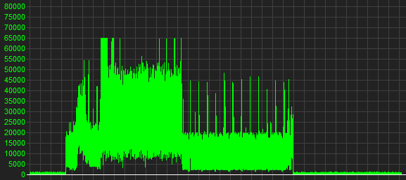
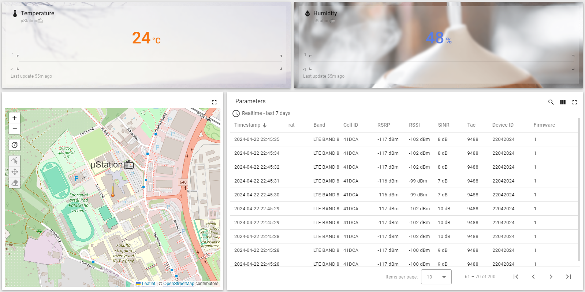

# μWeatherStation :partly_sunny:

The student project operated within the Bachelor's program Communications systems for IoT at Brno University of Technology.

## Description
We have been given a hypothetical scenario involving a micro-weather station with the following specifications:
- Deployment of the weather station on an old meteorological tower, at least 10 m high above the ground
- Location of the mast in areas without access to conventional connection methods (forest, remote buildings, fields)
- The mast is equipped with a power distribution system, but data lines are not present.
The weather station will send at defined intervals the values of the given quantities (temperature, humidity) to a remote server, as well as data and parameters relevant for the radio channel of the selected technology.

## Solution design
The project primarily works on the physical layer with LTE CAT-M technology and NB-IoT as a backup. We initialize the network connection via AT commands and then send the sensor values which are sent via I2C. On the school server, we run the MQTT application protocol, which provides us with the transmission in Json format. We display the data on the Thingsboard web page in the dashboard section, which displays the data in Json format.

In the project we also use PSM (Power Saving Mode) predefined to Active time of 16 seconds (Timer3324) and Periodic tau for 1 minute (Timer3412), which means the active transmission time is 16 seconds and then the device goes into PSM and is put into sleep for a minute.

## Used protocol
We have opted to use MQTT network protocol due to it's simplicity. It's lightweigth and reliable. It is ideal for its usage in remote locations, such as our old telephone tower. MQTT's 3-way handshake proves ideal for this situation. MQTT broker isn't vulnerable or insecure with the right configuration, making it ideal to pass data onto clients. This also means that we can have multiple clients subscribing to the same broker due to MQTT's Topic policy.

## Used equipment
- BPC-IOT Board V3
- BG77
- Grove AHT20 Temp/humid sensor
- YF0028AA 4G Adhesive Mount Antenna

## Block Diagram Solution

## Current measurement in PSM mode

## Demo

## Dependencies
Software is written to run on RP2040 with UF2 bootloader flashed in. Aditional mudules are used as a
hardware:
* [Raspberry Pi Pico](https://www.raspberrypi.com/products/raspberry-pi-pico/)
* [Grove - AHT20](https://wiki.seeedstudio.com/Grove-AHT20-I2C-Industrial-Grade-Temperature&Humidity-Sensor)

### Suggested toolchain
VSCODE + [MicroPico](https://marketplace.visualstudio.com/items?itemName=paulober.pico-w-go) extension.

## Help
Can´t run μPython on RP2040?\
  Check the μPython interpreter instalation [UF2 bootloader](https://www.raspberrypi.com/documentation/microcontrollers/micropython.html).

## Authors
Contributors names and contact info

  [@vanekroman](https://github.com/vanekroman)
  [Filip Tůma](https://github.com/FilipTuma2001)
  [Tomáš Calábek](https://github.com/siberiacaly)
  [Matěj Baranyk](https://github.com/baranykmatej)

## License
This project is licensed under the [MIT] License - see the LICENSE.md file for details

## Acknowledgments
Inspiration, code snippets, etc.
* Readme starting template by [@DomPizzie](https://gist.github.com/DomPizzie/7a5ff55ffa9081f2de27c315f5018afc)
* Contributors images made with [contrib.rocks](https://contrib.rocks).
